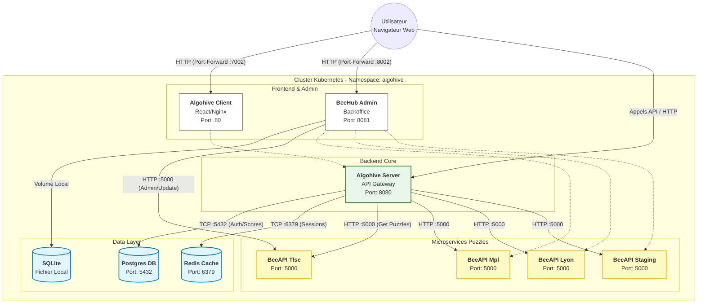

# Documentation technique : architecture microservices AlgoHive

## 1. Contexte
Le projet **AlgoHive** est une plateforme d'apprentissage du code basée sur une architecture distribuée (Microservices).
Ce document détaille le rôle de chaque composant et leurs interactions au sein du cluster Kubernetes.

---

## 2. Plateforme infra
Premier PoC en récupérant le code Algohive : https://github.com/AlgoHive-Coding-Puzzles/AlgoHive-Infra

Le docker compose a été transformé en manifestes K8S pour tester la faisabilité.
L'appli tourne actuellement sur un cluster `kind`.
Un refactoring et templating sera proposé dans une nouvelle itération

---

## 3. Cartographie des services

### Frontend
* **Service :** `algohive-client`
* **Rôle :** Interface utilisateur et administration des comptes
* **Comportement :** Affiche l'interface et envoie des requêtes API au serveur

### Backend 
* **Service :** `algohive-server`
* **Rôle :** Centralise les appels :
    * Authentification des étudiants (JWT)
    * Gestion des scores
    * Routage des demandes vers les catalogues d'exercices
* **Dépendances :** Connecté à la Base de Données (`db`) et au Cache (`redis`)

### Catalogues (BeeAPIs)
* **Services :** `beeapi-server-tlse`, `beeapi-server-mpl`, `beeapi-server-lyon`...
* **Rôle :** Hébergement décentralisé des exercices
* **Architecture :** Chaque instance représente un campus (Toulouse, Montpellier, etc.)
* **Persistence :** Utilise un **Persistent Volume (PVC)** pour stocker physiquement les fichiers des puzzles (.md, .json)
* **Interaction :** Le serveur principal les interroge via leur nom DNS interne (ex: `http://beeapi-server-tlse:5000`)

### Administration (BeeHub)
* **Service :** `beehub`
* **Rôle :** Back-office pour les professeurs. Permet de créer/modifier des puzzles et de gérer les catalogues BeeAPI
* **Spécificité :** Possède sa propre base de données légère (**SQLite**) persistée via un volume dédié, indépendante de la base principale

### Données & Persistance
* **Algohive DB (`postgres`)** : Stockage critique (Utilisateurs, Historique). Données persistantes via PVC
* **Algohive Cache (`redis`)** : Stockage volatile (Sessions, Cache API). Améliore les performances

---

## 4. Architecture

---
## 5. Data flow

### Scénario : Un étudiant lance un exercice
1.  **User** -> **Client** : Clic sur "Ouvrir Puzzle Toulouse"
2.  **Client** -> **Server** : Requête HTTP `GET /api/puzzles/tlse/1`
3.  **Server** -> **Redis** : Vérification du Token (Est-il connecté ?)
4.  **Server** -> **BeeAPI-Tlse** : Appel interne `GET /puzzles/1`.
5.  **BeeAPI-Tlse** : Lecture du fichier sur disque et réponse au serveur
6.  **Server** -> **Client** : Renvoi du JSON de l'exercice

---

## 6. Choix d'infrastructure (Kubernetes)
Le déploiement utilise les objets natifs K8s pour garantir robustesse et scalabilité :
* **Namespaces** : Isolation de l'environnement (`algohive`)
* **ConfigMaps/Secrets** : Externalisation de la configuration
* **Services (ClusterIP)** : Découverte de services via DNS interne
* **PVC (Persistent Volume Claims)** : Garantie de conservation des données (DB et Puzzles) indépendamment du cycle de vie des pods

---

## 7. Démarrage du PoC

Voir documentation [Setup_PoC_Kind](docs/SETUP_POC_kind.md)